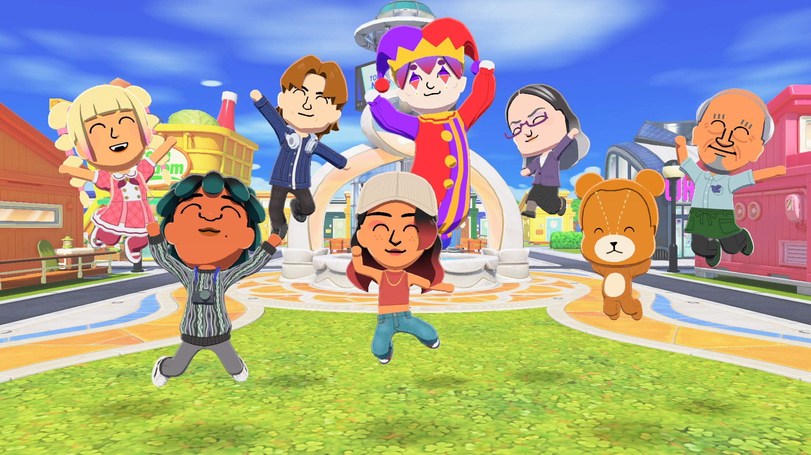
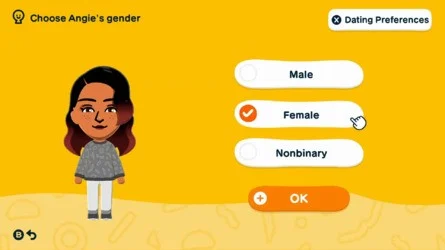
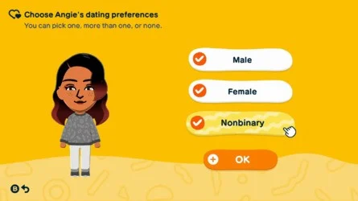

## 친구모아 아일랜드 두근두근 라이프"는 동성 관계와 논바이너리 미를 허용한다
> 원문을 읽고 싶으신가요? [여기](https://www.nintendolife.com/news/2026/01/tomodachi-life-living-the-dream-will-allow-same-sex-relationships-and-non-binary-miis)를 확인해 보세요.

마침내 "더 포용적이겠다"는 약속을 실현하다.

> 이미지: 닌텐도

**친구모아** 팬들은 오늘 축하할 거리가 많다. [친구모아 아일랜드 두근두근 라이프](https://www.nintendolife.com/games/nintendo-switch/tomodachi_life_living_the_dream)의 [출시일 공개](https://www.nintendolife.com/news/2026/01/tomodachi-life-living-the-dream-moves-in-on-switch-1-this-april)와 더불어, 닌텐도는 플레이어가 새로 출시되는 게임에서 논바이너리 미를 생성할 수 있고, 해당 캐릭터의 데이팅 선호를 선택할 수 있다고 확인하였다.

이 내용은 오늘 공개된 [친구모아 아일랜드 두근두근 라이프 닌텐도 다이렉트](https://www.youtube.com/watch?v=K_0kl1WiSPg)에서 모두 확인되었다. 커스터마이징과 창작의 자유도가 핵심인 이 게임에서, 더 많은 젠더와 관계 옵션이 주어지는 것은 당연한 수순이라고 할 수 있다. 이런 기능이 2013년에 추가되어야 했지만, 이번에는 닌텐도가 그 아쉬움을 제대로 만회하고 있다.

이제 미(mii)를 생성할 때 플레이어가 세 가지 젠더 옵션중에 선택할 수 있다. 선택할 수 있는 젠더에는 남성, 여성, 논바이너리가 있다. 미의 데이트 선호를 선택할 수도 있다, 세 가지 젠더를 기준으로 말이다. 하나, 하나 이상, 혹은 아예 선택하지 않을 수도 있다. 본질적으로, 누가 됐든 원하는 사람과 데이트할 수 있고, 원한다면 아예 데이트하지 않을 수도 있는 것이다. 이는 게이, 레즈비언, 양성애자, 범성애자, 무로맨틱, 무성애자 외 모든 종류의 LGBTQIA+ 관계를 폭넓게 포용한다는 의미이다.

> 이미지: 닌텐도

이는 3DS에서 친구모아 아파트를 즐겼던 많은 팬들에게 있어서 _엄청난_ 승리이다. 해당 작품이 2013년 일본 출시 당시에 적지 않은 비판을 받았기 때문이다. 처음에는, [게임 내에서 동성 결혼이 가능해지는 버그가 발견되었지만](https://www.nintendolife.com/news/2013/05/tomodachi_collection_new_life_features_same_sex_marriage_for_men_but_not_women) 닌텐도가 이후 이를 패치로 제거했다. 닌텐도는 패치 이후 [추가적인 해명](https://www.nintendolife.com/news/2014/04/nintendo_provides_some_context_to_2013s_tomodachi_life_same_sex_marriage_controversy)을 내놓긴 했지만, 원하는 상대와 자유롭게 데이트할 수 없다는 점에 팬들이 실망한 것도 무리는 아니었다.

This prompted the 'Miiquality' social media campaign ahead of the game's Western release, with Nintendo of America addressing [the controversy shortly after](https://www.nintendolife.com/news/2013/05/tomodachi_collection_new_life_features_same_sex_marriage_for_men_but_not_women). Then, two days later, [the company issued an apology](https://www.nintendolife.com/news/2014/05/nintendo_apologises_for_disappointing_many_people_over_tomodachi_life_same_sex_marriage_issue), stating "if we create a next installment in the Tomodachi series, we will strive to design a game-play experience from the ground up that is more inclusive, and better represents all players."

이로 인해 서구권 출시를 앞두고 'Miiquality'라는 SNS 캠페인이 벌어졌고, 닌텐도 오브 아메리카는 [해당 논란에 대한 공식 입장](https://www.nintendolife.com/news/2013/05/tomodachi_collection_new_life_features_same_sex_marriage_for_men_but_not_women)을 밝히게 된다. 그리고 이틀 뒤, [닌텐도는 공식 사과문을 발표하였는데](https://www.nintendolife.com/news/2014/05/nintendo_apologises_for_disappointing_many_people_over_tomodachi_life_same_sex_marriage_issue), 닌텐도는 이 사과문에서 "만약 친구모아 시리즈의 차기작을 만든다면, 처음부터 더 포용적인 게임플레이 경험을 설계하고, 모든 플레이어를 더 잘 대표할 수 있도록 노력하겠다"고 말했다.

그리고 오늘 닌텐도 다이렉트를 보면, 개발진이 그 약속을 실제로 지켜낸 것으로 보인다. 이는 정말 반가운 일이다. 이제 우리는 로맨틱하든 아니든 휴 모리스(Hugh Morris)와 시간을 보낼 수 있게 되었다.